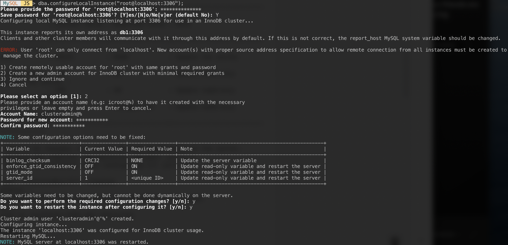

## Setting up MySQL InnoDB Cluster
This file contains steps for setting MySQL InnoDB cluster. At this time of writting this
article, latest version of MySQL is 8.0.22.

### Introduction
For implementing MySQL InnoDB Cluster you will need minimum four machines (servers/VMs). On each
server you need to install MySQL server (latest version: 8.0.22), MySQL Shell and MySQL Router.

To do this here are the steps:
1. Login to your servers
2. yum install mysql-server (only on DB nodes)
3. yum install mysql-client (on all machines)
4. yum install mysql-shell (on all machines)
5. yum install mysql-router (only on router server)
6. Configure and secure MySQL servers

### Configuration of DB nodes
In this section it will be explained how to create DB cluster, add new instances to existing 
cluster and start group replication.

#### Virtual host configuration
First, on all DB nodes and router node you have to configure **hosts** file located on `/etc/`.
1. vi /etc/hosts
2. setup IP addresses and host names

Example:
```
192.168.10.40   router
192.168.10.41   db1
192.168.10.42   db2
192.168.10.43   db3
```

#### Local instance configuration
The following steps should be performed on all database nodes db1, db2 and db3.

1. `mysqlsh`
2. `MySQL  JS > dba.configureLocalInstance("root@localhost:3306");`
3. After authentication you should get this kind of screen:  


Responses to those questions with the following answers:

Pick 2 - Create a new admin account for InnoDB cluster with minimal required grants
Account Name: **clusteradmin@%**  
Password: **mysecret#!**  
Confirm password: **mysecret#!**  
Do you want to perform the required configuration changes?: **y**  
Do you want to restart the instance after configuring it?: **y**  

#### Creating the cluster
On db1, connect as cluster admin from MySQL Shell:
```
MySQL|JS> shell.connect('clusteradmin@db1:3306');
Creating a session to 'clusteradmin@db1:3306'
Please provide the password for 'clusteradmin@db1:3306': ***********
Save password for 'clusteradmin@db1:3306'? [Y]es/[N]o/Ne[v]er (default No): Y
Fetching schema names for autocompletion... Press ^C to stop.
Your MySQL connection id is 9
Server version: 8.0.18 MySQL Community Server - GPL
No default schema selected; type \use <schema> to set one.
<ClassicSession:clusteradmin@db1:3306>
```
We can now create a new cluster:
```
MySQL|db1:3306 ssl|JS> cluster = dba.createCluster('my_innodb_cluster');
```
Check the cluster status:
```
MySQL|db1:3306 ssl|JS> cluster.status()
{
    "clusterName": "my_innodb_cluster",
    "defaultReplicaSet": {
        "name": "default",
        "primary": "db1:3306",
        "ssl": "REQUIRED",
        "status": "OK_NO_TOLERANCE",
        "statusText": "Cluster is NOT tolerant to any failures.",
        "topology": {
            "db1:3306": {
                "address": "db1:3306",
                "mode": "R/W",
                "readReplicas": {},
                "replicationLag": null,
                "role": "HA",
                "status": "ONLINE",
                "version": "8.0.22"
            }
        },
        "topologyMode": "Single-Primary"
    },
    "groupInformationSourceMember": "db1:3306"
}
```
At this point, only db1 is part of the cluster. The default topology mode is Single-Primary, similar to a replica 
set concept where only one node is a writer at a time. The remaining nodes in the cluster will be readers. 

Pay attention on the cluster status which says **OK_NO_TOLERANCE**, and further explanation under statusText key. 
In a replica set concept, one node will provide no fault tolerance. Minimum of 3 nodes is required in order
 to automate the primary node failover.
 
Now add the second node (from db1 node), db2 and accept the default recovery method, "Clone":
```
MySQL|db1:3306 ssl|JS> cluster.addInstance('logateadmin@db2:3306');
```
The following screenshot shows the initialization progress of db2 after we executed the above command. 
The syncing operation is performed automatically by MySQL:


Check the cluster and db2 status:
```
MySQL|db1:3306 ssl|JS> cluster.status()
{
    "clusterName": "my_innodb_cluster",
    "defaultReplicaSet": {
        "name": "default",
        "primary": "db1:3306",
        "ssl": "REQUIRED",
        "status": "OK_NO_TOLERANCE",
        "statusText": "Cluster is NOT tolerant to any failures.",
        "topology": {
            "db1:3306": {
                "address": "db1:3306",
                "mode": "R/W",
                "readReplicas": {},
                "replicationLag": null,
                "role": "HA",
                "status": "ONLINE",
                "version": "8.0.22"
            },
            "db2:3306": {
                "address": "db2:3306",
                "mode": "R/O",
                "readReplicas": {},
                "replicationLag": null,
                "role": "HA",
                "status": "ONLINE",
                "version": "8.0.22"
            }
        },
        "topologyMode": "Single-Primary"
    },
    "groupInformationSourceMember": "db1:3306"
}
```
At this point, we have two nodes in the cluster, db1 and db2. The status is still showing **OK_NO_TOLERANCE** with 
further explanation under statusText value. As stated above, MySQL Group Replication requires at least 3 nodes in a 
cluster for fault tolerance.

Add the last node, db3 and accept the default recovery method, "Clone" similar to db2:
```
MySQL|db1:3306 ssl|JS> cluster.addInstance('logateadmin@db3:3306');
```
The following screenshot shows the initialization progress of db3 after we executed the above command. 
The syncing operation is performed automatically by MySQL:


Check the cluster and db3 status:
```
MySQL|db1:3306 ssl|JS> cluster.status()
{
    "clusterName": "my_innodb_cluster",
    "defaultReplicaSet": {
        "name": "default",
        "primary": "db1:3306",
        "ssl": "REQUIRED",
        "status": "OK",
        "statusText": "Cluster is ONLINE and can tolerate up to ONE failure.",
        "topology": {
            "db1:3306": {
                "address": "db1:3306",
                "mode": "R/W",
                "readReplicas": {},
                "replicationLag": null,
                "role": "HA",
                "status": "ONLINE",
                "version": "8.0.22"
            },
            "db2:3306": {
                "address": "db2:3306",
                "mode": "R/O",
                "readReplicas": {},
                "replicationLag": null,
                "role": "HA",
                "status": "ONLINE",
                "version": "8.0.22"
            },
            "db3:3306": {
                "address": "db3:3306",
                "mode": "R/O",
                "readReplicas": {},
                "replicationLag": null,
                "role": "HA",
                "status": "ONLINE",
                "version": "8.0.22"
            }
        },
        "topologyMode": "Single-Primary"
    },
    "groupInformationSourceMember": "db1:3306"
}
```
Now the cluster looks good, where the status is OK and the cluster can tolerate up to one failure node at one time. 
The primary node is db1 where it shows "primary": "db1:3306" and "mode": "R/W", while other nodes are in "R/O" state. 
If you check the read_only and super_read_only values on RO nodes, both are showing as true.

### Configuration of DB Router
In this section it will be explained how to configure and start MySQL Router for 
InnoDB Cluster.

MySQL Router is installed under `/usr/bin/mysqlrouter`. MySQL router provides a bootstrap flag to automatically 
configure the router operation with a MySQL InnoDB cluster. MySQL Router is responsible for accepting connections
from application servers and to route them based on intention (read/write).

Bootstraping the router service:
```
mysqlrouter --bootstrap clusteradmin@db1:3306 --directory myrouter --user=root
```

Start the **mysqlrouter** daemon with the following command from the directory `/root/myrouter/`:
```
nohup ./start.sh > router.out &
```
Verify if the anticipated ports are listening correctly:
```
$ netstat -tulpn | grep mysql
tcp        0 0 0.0.0.0:6446            0.0.0.0:* LISTEN   14726/mysqlrouter
tcp        0 0 0.0.0.0:6447            0.0.0.0:* LISTEN   14726/mysqlrouter
tcp        0 0 0.0.0.0:64470           0.0.0.0:* LISTEN   14726/mysqlrouter
tcp        0 0 0.0.0.0:64460           0.0.0.0:* LISTEN   14726/mysqlrouter
```
Now our application can use port 6446 for read/write and 6447 for read-only MySQL connections.

### Connecting to the Cluster
Let's create a database user on the master node. On db1, connect to the MySQL server via MySQL shell:
```
mysqlsh root@localhost:3306
```
Switch from Javascript mode to SQL mode:
```
MySQL|localhost:3306 ssl|JS> \sql
Switching to SQL mode... Commands end with ;
```
Create a database:
```
MySQL|localhost:3306 ssl|SQL> CREATE DATABASE logate_test;
```
Create a database user:
```
MySQL|localhost:3306 ssl|SQL> CREATE USER logateuser@'%' IDENTIFIED BY 'password';
```
Grant the user to the database:
```
MySQL|localhost:3306 ssl|SQL> GRANT ALL PRIVILEGES ON logate_test.* TO logatetest@'%';
```
Now our database and user is ready.

### Firewall rules
1. Make sure the ports 33060, 33061, 3306 between DB machines are opened
2. Make sure the ports 6446 and 6447 are opened between MySQL router and application servers
3. Make sure the port 3306 is opened between MySQL Router and DB nodes
4. Make sure the **apparmor** is disabled
5. Make sure the **SELinux** is disabled

### Author
Heril Muratovic  
Software Engineer  
Logate D.O.O  
All Rights Reserved  
